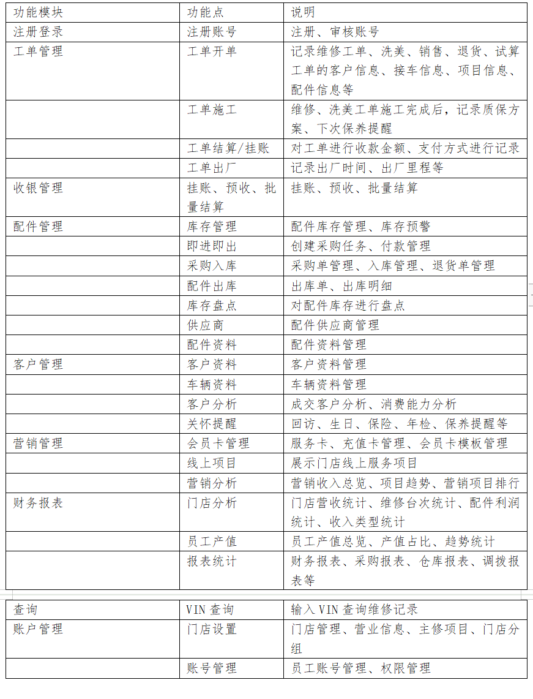

# 项目概述

系统为汽修门店提供维修管理、仓储管理、财务管理、线上营销等信息化服务，集车辆维修记录、客户信息、配件库存状态、财务收支等功能于一体，帮助汽车后市场门店更好地上传数据，同时达到拓客、锁客、留客。

# 启动命令
安装依赖

npm run install

启动项目

npm run dev

打包项目

npm run build

# 核心功能

『工单管理』随时查看进厂车辆的派单、施工、结算、出厂状态

『门店管理』实时图表化统计，经营状况一目了然

『配件管理』维修配件进销存等全面管理

『客户管理』客户画像分析、偏好分析，智能推送服务

『线上营销』会员制度管理、线上活动营销

『数据报表』经营数据统计分析，支持本地备份

# 功能清单

# 线上演示地址

https://saas.xlbzone.com/

账号：13760721322

密码：test888

如果您觉得此项目对你有帮助，请点亮 Star

# 联系我们
